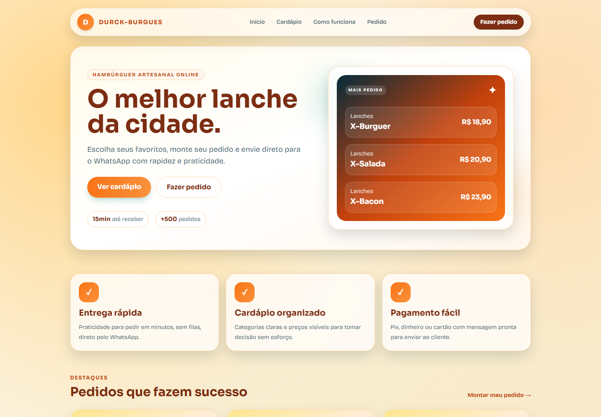

# Cardapio Multinicho

<p align="center">
  <strong>Uma base de cardapio digital adaptavel para diferentes tipos de negocio.</strong>
</p>

<p align="center">
  <a href="#sobre-o-projeto">Sobre</a> |
  <a href="#funcionalidades">Funcionalidades</a> |
  <a href="#como-executar">Como executar</a> |
  <a href="#perfis-de-negocio">Perfis</a> |
  <a href="#seguranca">Seguranca</a>
</p>

## Sobre o projeto

O **Cardapio Multinicho** e uma MVP full stack pensada para servir como base de demonstracao e personalizacao para negocios que recebem pedidos pelo WhatsApp.

A ideia e manter uma estrutura unica de sistema e adaptar apenas o que muda entre os clientes:

- identidade visual;
- nome e textos da marca;
- categorias e produtos;
- precos;
- chave Pix;
- numero do WhatsApp;
- configuracoes especificas do negocio.

A mesma base pode ser adaptada para hamburguerias, creperias, restaurantes, espetinhos, sorveterias, lanchonetes e outros nichos.

> **Nota de autoria e desenvolvimento:** este projeto foi idealizado e estruturado por **Megadurck**, com apoio de ferramentas de Inteligencia Artificial durante o desenvolvimento. A proposta do produto, a organizacao da solucao, as decisoes de negocio e o direcionamento do projeto foram pensados pelo autor. O repositorio nao pretende apresentar o trabalho como se tivesse sido criado integralmente por um desenvolvedor humano do zero.

## Visao do produto

### Homepage da hamburgueria



A interface usa o mesmo layout para todos os nichos. O perfil ativo altera a marca, o catalogo, os textos e o tema visual sem duplicar a aplicacao.
## Demonstração atual

O repositorio possui dois perfis configurados:

- **Durck-Burgues:** hamburgueria, porcoes e bebidas.
- **BiaCREPS:** creps, sucos, vitaminas e refrigerantes.

O perfil ativo e definido no arquivo `backend/.env`:

```env
RESTAURANT_CONFIG=biacreps
```

Para visualizar a hamburgueria:

```env
RESTAURANT_CONFIG=hamburgueria
```

Depois de alterar o perfil, reinicie o backend para a API carregar a nova configuracao.

## Stack utilizada

### Frontend

- React 18
- Vite
- Tailwind CSS
- JavaScript com JSX

### Backend

- Node.js
- Express
- whatsapp-web.js
- dotenv
- qrcode-terminal

### Arquitetura

O projeto usa npm workspaces e separa o frontend do backend:

```text
Frontend React -> API Express -> Perfil de negocio ativo
                              -> Gerador de pedido
                              -> WhatsApp Web local
```

## Funcionalidades

- Cardapio carregado pela API.
- Categorias organizadas em acordeao.
- Selecao de produtos com controles de quantidade.
- Soma automatica dos itens.
- Total parcial destacado durante a montagem do pedido.
- Formulario de cliente e endereco.
- Pagamento por Pix, dinheiro ou cartao.
- Calculo de troco para pagamentos em dinheiro.
- Geracao de mensagem pronta para WhatsApp.
- Chave Pix especifica por perfil.
- Mensagem do WhatsApp com nome da loja ativa.
- Identidade visual dinamica por perfil.
- Bot local com WhatsApp Web e autenticacao por QR Code.

## Estrutura de pastas

```text
cardapio-multinicho/
├── backend/
│   ├── .env.example
│   ├── package.json
│   └── src/
│       ├── config/
│       │   ├── menu.js
│       │   └── restaurantProfiles.js
│       ├── services/
│       │   ├── orderMessageBuilder.js
│       │   └── whatsappWebClient.js
│       └── index.js
├── frontend/
│   ├── .env.example
│   ├── package.json
│   └── src/
│       ├── App.jsx
│       ├── index.css
│       └── main.jsx
├── BOT-SETUP.md
├── LICENSE
├── package-lock.json
├── package.json
└── .gitignore
```

## Requisitos


## Como executar

### 1. Instalar dependencias

Na raiz do projeto:

```bash
npm install
```

### 2. Configurar o backend

Crie o arquivo local de ambiente a partir do exemplo.

No Windows PowerShell:

```powershell
Copy-Item backend\.env.example backend\.env
```

No Prompt de Comando:

```bat
copy backend\.env.example backend\.env
```

Edite `backend/.env` e defina o perfil desejado:

```env
RESTAURANT_CONFIG=biacreps
```

Exemplo de configuracao:

```env
PORT=3001
RESTAURANT_CONFIG=biacreps
PIX_KEY_BIACREPS=000.000.000-00
PIX_KEY_HAMBURGUERIA=000.000.000-00
STORE_WHATSAPP_NUMBER=5511999999999
WEB_MENU_URL=http://localhost:5173
```

### 3. Configurar o frontend

```powershell
Copy-Item frontend\.env.example frontend\.env
```

Exemplo:

```env
VITE_API_URL=http://localhost:3001
VITE_STORE_WHATSAPP_NUMBER=5511999999999
```

### 4. Iniciar frontend e backend

```bash
npm run dev
```

Acesse:


Se a porta estiver ocupada, o Vite pode iniciar em outra porta, como `5174` ou `5175`.

### Comandos separados

Somente frontend:

```bash
npm run dev:frontend
```

Somente backend:

```bash
npm run dev:backend
```

Iniciar backend em modo normal:

```bash
npm run start --workspace backend
```

## Como trocar o nicho

1. Abra `backend/.env`.
2. Altere `RESTAURANT_CONFIG`.
3. Reinicie o backend.
4. Recarregue o frontend.

Exemplo para hamburgueria:

```env
RESTAURANT_CONFIG=hamburgueria
```

Exemplo para creperia:

```env
RESTAURANT_CONFIG=biacreps
```

O frontend permanece o mesmo. Ele recebe da API o catalogo e as informacoes de marca do perfil selecionado.

## Como criar um novo perfil

Os perfis ficam em `backend/src/config/restaurantProfiles.js`.

Um novo nicho deve seguir esta estrutura:

```js
restaurantProfiles.sorveteria = {
  id: 'sorveteria',
  pixKey: '000.000.000-00',
  branding: {
    name: 'Nome da Sorveteria',
    shortName: 'Nome da Sorveteria',
    logoLetter: 'S',
    theme: 'sorveteria',
    eyebrow: 'Seu sorvete favorito',
    heroTitle: 'Sabor para deixar o dia mais leve.',
    heroDescription: 'Monte seu pedido e envie pelo WhatsApp.',
    popularLabel: 'Mais pedidos',
    orderTitle: 'Monte seu pedido agora',
    highlightTitle: 'Favoritos da casa'
  },
  categories: [
    {
      id: 'sorvetes',
      name: 'Sorvetes',
      items: [
        { id: 'sorvete-chocolate', name: 'Chocolate', price: 10.0 }
      ]
    }
  ]
};
```

Depois, ative o perfil:

```env
RESTAURANT_CONFIG=sorveteria
```

## API principal

| Metodo | Rota | Funcao |
|---|---|---|
| GET | `/health` | Verifica se o backend esta online |
| GET | `/api/menu` | Retorna o perfil e o cardapio ativos |
| POST | `/api/orders/preview` | Calcula o pedido e gera a mensagem |
| GET | `/api/whatsapp/status` | Retorna o status do WhatsApp |
| POST | `/api/whatsapp/send-message` | Envia uma mensagem manual |

### Exemplo de pedido

```json
{
  "customerName": "Maria",
  "address": "Rua A, 100, Centro",
  "paymentMethod": "pix",
  "changeFor": "",
  "notes": "Sem cebola",
  "items": [
    { "id": "x-burguer", "quantity": 2 },
    { "id": "coca-lata", "quantity": 1 }
  ]
}
```

## WhatsApp Web local

O bot usa `whatsapp-web.js` e roda localmente, sem Meta Cloud API e sem ngrok.

Para iniciar:

```bash
npm run start --workspace backend
```

Ao aparecer o QR Code:

1. Abra o WhatsApp no celular.
2. Acesse **Dispositivos conectados**.
3. Toque em **Conectar um dispositivo**.
4. Escaneie o QR Code no terminal.

A sessao local e armazenada pelo `LocalAuth`. Para detalhes de operacao e troubleshooting, consulte [BOT-SETUP.md](BOT-SETUP.md).

## Seguranca e ambiente

Arquivos locais de ambiente nunca devem ser enviados ao repositorio:


Tambem sao ignorados:


Nunca coloque no GitHub:


Se uma credencial real ja tiver sido publicada, revogue e gere outra imediatamente. O `.env.example` deve conter somente valores ficticios.

## Estado do projeto

Este repositorio representa uma **MVP funcional para demonstracao e customizacao comercial**. Antes de uma operacao real em producao, recomenda-se adicionar:


## Licenca

Este projeto esta distribuido sob a [Licenca MIT](LICENSE). Consulte o arquivo para conhecer as permissoes e responsabilidades de uso.

## Creditos

Projeto idealizado e direcionado por **Megadurck**, com desenvolvimento apoiado por ferramentas de Inteligencia Artificial.

A IA foi utilizada como apoio para exploracao, implementacao, revisao e documentacao. A ideia do produto, a visao de uma base multinicho e as decisoes de adaptacao para diferentes clientes pertencem ao autor do projeto.
